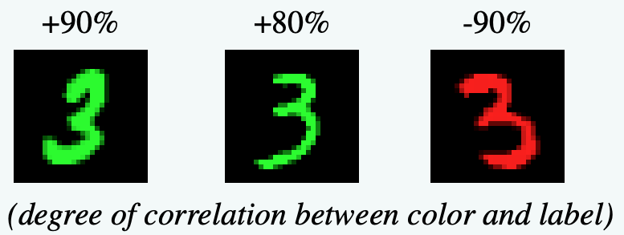
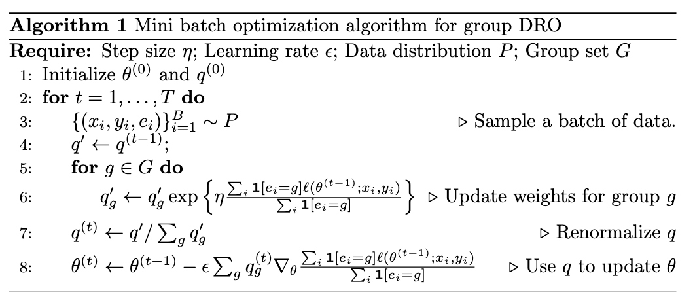

# AISG Programming Assignment ColoredMNIST

## 数据集描述



ColoredMNIST [1] 是经典数字识别数据集 MNIST 的一种变体。通过为图像上色，人为地制造了标签与颜色之间的虚假相关性，从而产生了**概念漂移**。

数据集的转换过程包括以下几个步骤：

1. 从 MNIST 中定义三个环境（两个训练环境，一个测试环境），每个环境包含 20,000 个样本。 
2. 对于每个样本，根据数字为图像分配一个初步的二值标签 $\tilde y$。若数字为 0-4，则 $\tilde y = 0$；若数字为 5-9，则 $\tilde y = 1$。 
3. 通过以概率 $p_f=0.25$ 翻转 $\tilde y$ 来获得最终标签 $y$。 
4. 通过以概率 $p_e$ 翻转 $y$ 来采样颜色 ID $z$，其中在第一个训练环境中 $p_e = 0.1$，在第二个训练环境中 $p_e = 0.2$，在测试环境中 $p_e = 0.9$。若 $z = 1$，则将图像着色为红色；若 $z = 0$，则着色为绿色。 

因此，颜色在两个训练环境中与标签呈正相关，但相关程度不同。而在测试环境中，这种相关性被反转。 

我们对数据集进行了简化，将概率重新设置为：
$$
p_f = 0.2, \quad p_e = 0.1, 0.4 \text{ for training and } 0.9 \text{ for test}.
$$

## 算法

本作业需要实现两种算法：Group DRO 和 IRM，每正确实现1个算法计15分**，总分不超过 20 分**

### ERM

我们已经实现了**经验风险最小化 (ERM)**，通过结合所有训练环境 $e\in E$ 的二元交叉熵损失，训练环境的样本数为 $N_e$。标签和预测值分别用 $y$ 和 $\hat y$ 表示。
$$
\begin{align}
\mathcal{L}_{\text{ERM}} &= \frac{1}{|E|}\sum_{e} \mathcal L_e \\
&= \frac{1}{|E|}\sum_e \frac{1}{N_e} \sum_{i=1}^{N_e} \Big[-y_i^{(e)} \log \hat{y}_i^{(e)} - (1 - y_i^{(e)}) \log (1 - \hat{y}_i^{(e)})\Big].
\end{align}
$$

### TODO: Group DRO (15'')

Group DRO [3] 用于训练针对群体偏移具有分布鲁棒性的神经网络，通过重新加权不同群体以关注高风险子群体。算法如下图所示：



我们建议在本作业中使用 $\eta = 0.05$ 

#### 评分标准

- (15'') 测试集准确率 $\geq 60\%$.
- (10'') 测试集准确率 $\geq 55\%$.

### TODO: IRM (15'')

**Invariant Risk Minimization (IRM)** [1] 通过学习数据的表示 $\Phi$，使得在该表示上构建的预测器 $w\circ\Phi$ 在所有训练环境中都同时最优。通过采用一维表示 $\Phi\in\mathbb R$ 并**固定**预测器 $w=1.0$，IRM 的优化目标可通过添加正则项实现： 
$$
\mathcal L_{\text{IRM}} = \mathcal L_{\text{ERM}}(\Phi) + \lambda\cdot\frac{1}{|E|}\sum_e \Big\|\nabla_{w|w=1.0}\mathcal L_e(w\circ\Phi)\Big\|^2
$$
我们建议在本作业中使用 $\lambda = 50$ 

#### 评分标准

- (15'') 测试集准确率 $\geq 60\%$.
- (10'') 测试集准确率 $\geq 55\%$.

## 作业说明

请基于代码框架完成编程作业。需要实现 Group DRO 和 IRM 的两部分，完成有 `TODO` 标记部分的对应代码。代码框架的目录结构如下：

```
└─hw_OOD
    ├─README.pdf
    │           
    └─src
        ├─dataset.py             dataloader
        ├─exp-mnist.py           主文件
        ├─LICENSE
        ├─metric.py              性能指标（准确率、AUC、macro F1）
        ├─model.py               (TODO) MLP 模型和损失函数
        ├─preprocessing.py       下载并生成 ColoredMNIST 数据集
        ├─register.py
        ├─requirements.txt
        ├─run.sh                 运行所有实验的脚本
        └─trainer.py             训练过程

```

#### 建议完成步骤：

1. 安装 `python` 和程序依赖的环境：

```cmd
pip install -r requirements.txt
```

2. 运行基础 ERM 算法，以检查环境是否正确配置：

```
python exp-mnist.py  --seed xxxx --trainer ERM > ERM_log.txt
```

日志将保存在 `ERM_log.txt`，文件末尾有输出实验结果，如下所示：

```json
Summary: {'Accuracy_testmean': 0.5047, 'Accuracy_teststd': 0.05599590758856103, 'AUC_testmean': 0.4348140903478652, 'AUC_teststd': 0.06026994797221927, 'F1_macro_testmean': 0.5034497162692105, 'F1_macro_teststd': 0.056703574819522484}
```

3. *简要* 阅读 `exp-mnist.py` 文件，了解实验设计，包括数据集的构建、模型、优化器
3. 阅读 `trainer.py` 文件，理解训练过程，特别是损失和正则化的计算。
3. *仔细* 阅读 `model.py` 文件，理解 MLP 模型结构。注意模型中添加了一个 `output_layer`，其值固定为 1，可用于 IRM 正则化的计算。
3. 实现 `groupDRO` 和 `IRM` 两个类，它们是 `Loss` 的子类。
3. ==**编辑 `run.sh` 文件，将 `seed` 参数设置为学号的后四位。**==运行以下命令测试实现：

```cmd
chmod +x run.sh
./run.sh
```

日志将保存在 `IRM_log.txt` 和 `groupDRO_log.txt` 中，可以检查日志以确保准确率是否满足要求。

8. 提交**代码**和**日志文件**，按以下结构和命名规则打包为 `zip` 格式上传，文件名为 `studentID_name.zip`。
   - **请勿**上传已下载的数据集。
   - 请不要修改输出格式，以便助教检查。事实上，我们建议只修改`model.py`来完成本次实验

```
└─studentID_name
    ├─README.pdf
    │           
    └─src
        ├─dataset.py             
        ├─exp-mnist.py           
        ├─LICENSE
        ├─metric.py              
        ├─model.py							 
        ├─preprocessing.py       
        ├─register.py
        ├─requirements.txt
        ├─run.sh	
        ├─IRM_log.txt
        ├─groupDRO_log.txt
        └─trainer.py
```

#### 注意事项

- ColoredMNIST 数据集在首次运行时会随机生成，后续运行保持一致。删除生成的 `ColoredMNIST` 文件夹将重新生成随机数据。
- 默认使用 GPU 运行代码，可使用参数 `--no_cuda` 在 CPU 上运行。
- 如果算法实现正确，默认超参数即可满足准确率要求。不建议调参，但允许调参。
- 如果 ColoredMNIST 数据集无法自动下载，请从 [此处](https://cloud.tsinghua.edu.cn/d/71f7d5bfba5b463789aa/) 下载，将 `.pt` 文件放入 `data/ColoredMNIST` 目录。
- **无需提交实验报告**
  - 请尽量不要修改`model.py`以外的代码，如有修改，请在提交文件中附上一个简短的说明
- 如在完成作业的过程中有任何疑问，请联系课程助教 lkh20@mails.tsinghua.edu.cn。
- PyTorch 在线文档：https://pytorch.org/docs/stable/index.html

## 参考文献

[1] Arjovsky, M., Bottou, L., Gulrajani, I., & Lopez-Paz, D. (2019). Invariant risk minimization. *arXiv preprint arXiv:1907.02893*.

[2] Gulrajani, I., & Lopez-Paz, D. (2020). In search of lost domain generalization. *arXiv preprint arXiv:2007.01434*.

[3] Sagawa, Shiori, Pang Wei Koh, Tatsunori B. Hashimoto, and Percy Liang. "Distributionally robust neural networks for group shifts: On the importance of regularization for worst-case generalization." *arXiv preprint arXiv:1911.08731* (2019).

