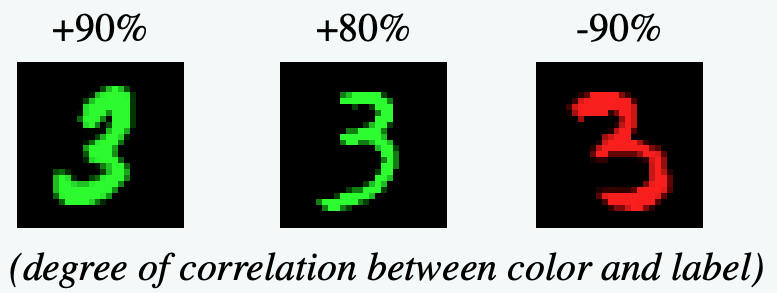

# 如何构建“好”的学习数据？探究环境划分与数据平衡在分布外泛化任务中的效果

## 引言

在机器学习的应用中，模型常常需要在与训练数据分布不同的未知环境中做出预测，这就是分布外泛化（Out-of-Distribution, OOD）挑战。传统的经验风险最小化（ERM）方法在训练数据和测试数据同分布时表现良好，但在OOD场景下性能会急剧下降。提升模型在OOD场景下的表现，对构建真正鲁棒和可靠的人工智能系统是很重要的。

然而，OOD泛化的难点是模型可能会学到训练数据中存在的虚假相关性（spurious correlations），而非本质的、不变的特征。这些虚假相关性可能源于数据采集过程中的偏差、标签噪声或其他偶然因素。比如，在图像分类任务中，模型可能会过度依赖背景信息而非物体本身；在自然语言处理任务中，模型可能仅仅因为否定词的存在就判断句子为矛盾关系。

这就引出了我们的研究问题：**我们应该怎样构建训练数据，才能帮助模型学习到本质的不变特征，而不是被数据中偶然出现的虚假相关所误导？** 在大作业中，我们聚焦于这个问题，先调研和复现了这个领域经典的IRM和DRO系列方法，接着重点探究了环境划分（Environment Partitioning）与数据平衡（Data Balancing）这两个维度，通过提出我们的直观假设并进行实验验证，研究了它们具体如何影响和提升OOD泛化能力，并对领域最前沿的研究获得了更多理解。

## 基准方法

我们首先调研并实现了一系列在分布外泛化领域公认的基准算法。这些方法主要分为不变风险最小化（IRM）系列和分布鲁棒优化（DRO）系列。

### IRM 系列
不变风险最小化（Invariant Risk Minimization, IRM）的核心思想是**学习数据中跨不同环境的不变性**，从而期望在未知的测试环境中也能保持良好的表现。

#### IRM (Invariant Risk Minimization)

IRM旨在通过寻找一个数据表示 $\Phi$，使得在该表示下，所有已知的训练环境 $e \in \mathcal{E}_{tr}$ 中的最优分类器 $w$ 都是相同的。那么这个分类器就学到了跨环境的不变性，理论上可以去除掉虚假相关性的影响、更好地泛化到未见过的测试环境。

**核心公式**：
IRM的目标可以表示为一个双层优化问题：
$$
\begin{align*}
& \min_{\Phi, w} \sum_{e \in \mathcal{E}_{tr}} \mathcal{R}^e(w \circ \Phi), \\
& \text{subject to } w \in \arg\min_{w'} \mathcal{R}^e(w' \circ \Phi) \text{ for all } e \in \mathcal{E}_{tr}.
\end{align*}
$$
由于在实际中这个问题难以优化，研究者们提出了在实践中更容易优化的版本IRMv1。IRMv1引入了一个正则化项，目标函数如下 ：
$$
\min_{\Phi,w} \sum_{e \in \mathcal{E}} \mathcal{R}^e(w \circ \Phi) + \lambda \cdot \| \nabla_{w|w=1.0} \mathcal{R}^e(w \circ \Phi) \|^2
$$
其中，$\mathcal{R}^e(w \circ \Phi)$ 是模型在环境 $e$ 上的损失，$w \circ \Phi$ 表示先通过 $\Phi$ 提取特征再通过 $w$ 进行分类。$\lambda$ 是一个超参数，用于平衡经验风险和不变性惩罚项。该惩罚项衡量的是损失函数在各个环境下对分类器参数 $w$ 的梯度(固定为标量1.0时的梯度范数平方)。如果分类器在所有环境下都是最优的，这个梯度范数理论上应为零；如果不是最优的，则梯度范数会大于零。IRM通过最小化这个范数来鼓励模型学习到一个在所有环境中都表现良好的分类器。

#### REx (Risk Extrapolation)

REx同样致力于提升模型在不同环境下的稳定性，但它采用了另一种思路。它认为，如果一个模型在所有已知训练环境中的风险（损失）都差不多，那么它可能更不依赖于特定环境的特性，有更好的泛化能力。

**核心公式**：
REx通过最小化训练环境之间风险的方差来鼓励模型的稳定性。其目标函数为：
$$
\min_{\theta} \mathbb{E}_{e \in \mathcal{E}}[\mathcal{R}^e(\theta)] + \lambda \cdot \text{Var}_{e \in \mathcal{E}}[\mathcal{R}^e(\theta)]
$$
这里，$\mathbb{E}_{e \in \mathcal{E}}[\mathcal{R}^e(\theta)]$ 是所有环境的平均风险，而 $\text{Var}_{e \in \mathcal{E}}[\mathcal{R}^e(\theta)]$ 是这些风险的方差。通过惩罚风险的方差，REx鼓励模型在所有已知环境中都能稳健地执行。

#### InvRat (Invariant Rationalization)

InvRat受到IRM寻求不变性思想的启发，但更侧重于模型决策依据的“不变基本原理”（invariant rationales）。它旨在识别输入特征中那些对预测结果具有跨环境不变解释性的部分。

**核心公式**：
InvRat的目标是找到一个特征表示 $\Phi$ 和一个分类器 $w$，使得分类器在每个环境中都接近该环境下的最优分类器。其目标函数为：
$$
\min_{\omega, \Phi} \max_{w^1 \ldots w^e} \sum_{e} \mathcal{R}^e(\omega, \Phi) + \lambda (\mathcal{R}^e(\omega, \Phi) - \mathcal{R}^e(\omega^e, \Phi))
$$
其中 $\mathcal{R}^e(\omega, \Phi)$ 是当前模型在环境 $e$ 的风险，而 $\mathcal{R}^e(\omega^e, \Phi)$ 是在该环境下最优分类器 $w^e$ 的风险。通过最小化这两者之间的差值（或确保其为负），InvRat鼓励模型学习到在所有环境中都表现接近最优的分类器。

### DRO 系列

分布鲁棒优化（Distributionally Robust Optimization, DRO）系列方法旨在通过**优化模型在最坏情况下的数据分布或群体上的性能**，来提升模型的鲁棒性。

#### Group Distributionally Robust Optimization (Group DRO)

Group DRO旨在通过显式地优化在预先定义的各个数据群体（groups）中的最坏情况损失，来提升模型在所有群体上的性能和鲁棒性。

**主要方法**：
Group DRO的核心思想是将数据划分为若干个群体，并最小化这些群体中最大的（即最坏的）期望损失 。具体步骤包括：
1.  **群体定义**：根据已知的、可能导致虚假相关性的属性（如图像背景、文本中的特定词汇、人口统计学特征等）将数据划分为多个群体 $g \in \mathcal{G}$ 。
2.  **最坏情况优化**：优化模型参数 $\theta$，以最小化在所有群体 $g$ 上的最大损失。其目标函数可以表示为 ：
    $$
    \hat{\theta}_{\text{DRO}} := \arg\min_{\theta \in \Theta} \max_{g \in \mathcal{G}} \mathbb{E}_{(x,y)\sim \hat{P}_g}[\ell(\theta; (x,y))]
    $$
    其中 $\hat{P}_g$ 是群体 $g$ 的经验分布，$\ell(\theta; (x,y))$ 是损失函数 。
    为了更好地考虑泛化差距，特别是当群体大小 $n_g$ 不同时，可以采用带调整的Group DRO目标 ：
    $$
    \hat{\theta}_{\text{adj}} := \arg\min_{\theta \in \Theta} \max_{g \in \mathcal{G}} \left\{ \mathbb{E}_{(x,y)\sim \hat{P}_g}[\ell(\theta; (x,y))] + \frac{C}{\sqrt{n_g}} \right\}
    $$
    其中 $C$ 是一个超参数 。
3.  **算法实现**：通常采用在线更新权重的方式进行优化。在每个训练步骤中，会根据各个群体当前的损失来调整其在总体损失函数中的权重，损失越大的群体会被赋予更高的权重 。如算法1所示，在每轮迭代中，会先更新各群组的权重$q'_g$，再根据这些权重更新模型参数$\theta$ 。

**优点**：
1.  **鲁棒性提升**：能够显著改善模型在表现最差的群体上的性能，实验表明可带来10-40个百分点的提升 。
2.  **灵活性**：允许研究者根据先验知识灵活定义数据群体，使其能适应多种不同的任务场景 。
3.  **与正则化兼容**：结合强正则化技术（如较大的 $\ell_2$ 权重惩罚或早停策略）可以进一步提升模型的泛化能力 。

**缺点**：
1.  **依赖群体定义**：性能高度依赖于群体划分的准确性；不恰当的群体定义可能会限制其效果 。
2.  **计算复杂度增加**：相较于标准ERM，优化最坏情况损失通常需要更复杂的算法和更多的计算资源 。
3.  **过参数化问题**：在深度学习等过参数化模型中，若不配合有效的正则化，Group DRO可能无法有效改善最坏群体的泛化性能 。

#### ChiSquareDRO

在许多实际优化问题中，我们希望约束某个随机函数 $h(x;\xi)$ 的期望值，但其真实分布 $P_0$ 未知，只能通过有限样本进行估计。传统的样本平均近似（SAA）方法直接用样本均值替代期望值，在样本量有限或分布存在不确定性时，其统计性能可能不足。ChiSquareDRO旨在通过构建一个围绕经验分布的不确定性集合（ambiguity set），并优化在该集合内最坏情况下的期望值，从而提供更强的统计保证，同时保持计算上的可行性 。它特别关注如何恢复由中心极限定理（CLT）所能提供的统计保证。

**主要方法**：
1.  **问题建模**：目标是处理形如 $Z_0(x) := E_{P_0}[h(x;\xi)] \leq 0$ 的期望值约束，其中 $P_0$ 是真实的但未知的分布 。
2.  **不确定性集合的构建**：ChiSquareDRO使用基于Burg熵散度（或$\chi^2$散度）的球来定义不确定性集合 $\mathcal{U}$。例如，基于Burg熵的散度球定义为 ：
    $$
    \mathcal{U}_{Burg} = \left\{ \mathbf{p} : -\sum_{i=1}^k \hat{p}_i \log \frac{p_i}{\hat{p}_i} \leq \frac{\chi^2_{k-1,1-\alpha}}{2n}, \sum_{i=1}^k p_i = 1, p_i \geq 0 \right\}
    $$
    其中 $\hat{p}_i$ 是经验分布的概率，$\chi^2_{k-1,1-\alpha}$ 是卡方分布的临界值，$n$ 是样本量 。
3.  **鲁棒对应约束**：原期望约束被替换为一个鲁棒约束，即要求在不确定性集合 $\mathcal{U}$ 内的所有可能分布 $Q$ 下，期望约束都得到满足 ：
    $$
    \min_{\theta} \max_{Q:D_{\chi^2}(Q\|P) \leq \rho} \mathbb{E}_{(x,y)\sim Q}[\mathcal{L}(x,y;\theta)]
    $$
    其中 $D_{\chi^2}(Q\|P)$ 是 $Q$ 相对于经验分布 $P$ 的$\chi^2$散度，$\rho$ 是预设的散度半径 。该最小最大问题通常可以转化为一个更易于处理的凸优化问题，其近似形式为 ：
    $$
    \min_{\theta} \mathbb{E}_{P}[\mathcal{L}(\theta)] + \sqrt{\rho \cdot \text{Var}_P(\mathcal{L}(\theta))}
    $$
    这个形式清晰地展示了对经验风险的惩罚项，该惩罚项与风险的方差和不确定性半径 $\rho$ 相关 。
4.  **$\chi^2$-Process 校准**：为了确保鲁棒约束能以预设的概率 $1-\alpha$ 覆盖真实的期望值（即 $P(Z_0(x) \leq \max_{P \in \mathcal{U}} E_P[h(x;\xi)]) \ge 1-\alpha$），散度球的半径（或等价的参数 $\rho$）需要被仔细校准。ChiSquareDRO利用了经验似然理论和$\chi^2$-Process的极值分位数 $q_n$ 来进行校准，以达到渐近精确的覆盖概率 。

**优点**：
1.  **优越的统计性能**：通过$\chi^2$-Process校准，能够恢复CLT所提供的统计保证，使得覆盖概率接近预设的置信水平（如95%）。
2.  **计算可行性**：基于Burg熵或$\chi^2$散度的DRO问题通常具有易于计算的对偶形式，可以转化为凸优化问题 。
3.  **无需绝对连续性假设**：与一些依赖于真实分布与经验分布之间密度比的DRO方法不同，基于经验散度球的方法直接对数据点进行加权，避免了对密度函数的估计 。

**缺点**：
1.  **高维决策空间的复杂性**：在决策变量 $x$ 的维度 $m$ 很高时，$\chi^2$-Process极值分位数的计算可能变得复杂 。
2.  **两阶段优化过程**：通常需要先通过校准过程确定散度球的半径，然后再求解DRO问题，这可能增加总体计算负担 。
3.  **对小样本的敏感性**：在样本量 $n$ 非常小的情况下，覆盖概率可能仍低于理论值，需要足够大的样本量或对分位数进行调整来缓解 。

## 环境划分

### 动机

在许多OOD泛化问题中，数据往往可以被划分为若干个“环境”，每个环境内部数据分布相对稳定，但不同环境间的分布可能存在差异。这些差异可能源于某些因素的变化，而这些因素可能与任务标签产生虚假相关性。如果模型不加区分地在混合了所有环境的数据上进行训练，很容易学到这些虚假相关性，而在新的、未见过的环境中表现不佳。因此，我们的一个想法是，**如果我们能够合理地划分出这些环境，特别是那些能够凸显虚假关系的环境，那么模型就有机会学习到在各个环境中都保持不变的、本质的特征。**

### 核心思路与方法

我们先对“环境”和“好环境”进行了定义 ：
* **环境**：在数据的因果图上，当我们对某些变量施加特定限制，其他变量遵循一定分布的集合，可以视为一个环境 。
* **好环境**：指的是那些通过特定限制能够尽可能多地暴露或包含数据中存在的虚假关系的环境。

例如，在猫狗分类任务中，如果“狗”的图片大多在“草地”背景，而“猫”的图片大多在“水边”背景，那么将“背景类型”作为划分环境的依据，就能形成有助于模型识别这种虚假相关的“好环境”。

基于这种想法，我们提出了2步的环境划分策略：
1.  **选择与标签尽可能相关的特征**：这一步的目标是识别出那些既可能包含真实判别信息，也可能引入虚假相关性的特征。具体来说，我们尝试了两种选择特征的方法：
    * **手动选择特征**：基于领域知识或对数据的初步分析，人工选定一些候选特征。例如，在动物分类例子中，我们可以手动选择“动物鼻子形状”和“背景类别”作为特征。
    * **VAE学习特征**：尝试使用变分自编码器（Variational Autoencoder, VAE）从原始数据中自动学习相关的潜在特征表示。VAE通过编码器将输入数据映射到低维隐空间，再通过解码器从隐变量重构数据，其隐变量理论上可以捕获数据的主要特征。
2.  **根据选定特征划分环境**：一旦特征被选定，就可以根据这些特征的**不同组合**来定义不同的环境。例如，如果选择了“动物类型”（猫/狗）和“背景”（草/水），就可以得到四个环境：{狗+草}，{狗+水}，{猫+草}，{猫+水}。

在环境划分完成后，接下来的步骤是在这些划分出的环境上应用特定的学习算法，例如不变风险最小化（IRM）算法学出来跨环境的不变性，或者对不同环境的数据进行加权平衡后再进行经验风险最小化（ERM）训练。核心目标都是让模型学到不依赖于特定环境虚假相关的知识。

## 平衡数据

### 动机

在实际数据集中，不同环境或不同子群体的样本数量往往是**不均衡**的。标准的ERM方法可能会在样本量大的环境或群体上学的很好，但在样本量小的环境上表现不好。而数据中的不平衡本身也可能是一种虚假相关性，模型可能会无意中学到“多数类偏差”。

就如我们上面提到的例子，如果在动物分类任务中，狗和草一同出现、猫和水一同出现的数据很多，而狗和水、猫和草的数据很少，那么模型可能会学到“狗=草，猫=水”的虚假相关性，而忽略了真正的动物特征。

**为了打破这种从数据集上带来的偏见，我们提出了一种非常直观的数据平衡策略。该策略的核心思想是对不同环境或样本进行加权，使得模型在训练时能够同等重视所有环境，从而提升模型的泛化能力。** 这种思想也借鉴了因果推断中的IPW（Inverse Probability Weighting）和稳定学习（Stable Learning）中对样本进行加权以消除混淆偏倚或提升分布鲁棒性的想法。

### 核心思路与方法

我们设想，在平衡的数据集上训练模型能带来更好的泛化性，因为它可以：
* 促进不同特征之间的独立性学习。
* 理论上，一个在所有相关特征组合上都达到平衡的、随机化的数据分布，其训练出的模型泛化能力最好。

基于此，我们提出的具体想法是：假设存在 $k$ 个已划分好的环境，每个环境 $e_i$ 中分别包含 $n_i$ 个样本。那么，在计算总体损失时，对来自第 $i$ 个环境的样本所产生的损失（loss）赋予一个权重 $w_i \propto 1/n_i$。这样做，直观上等同于在数据集层面进行了平衡，使得每个环境对总损失的贡献大致相当，无论其包含的样本多少。

这种加权方式可以类比于IPW中的思想，其公式形式如 $ATE_{IPW} = \frac{1}{n}\sum_{i=1}^{n} \frac{T_i Y_i}{\hat{e}(X_i)} - \frac{1}{n}\sum_{i=1}^{n} \frac{(1-T_i)Y_i}{1-\hat{e}(X_i)}$，其中 $T_i$ 是处理变量，$Y_i$ 是结果，$\hat{e}(X_i)$ 是倾向得分，权重 $w_i = \frac{T_i}{e_i} + \frac{1-T_i}{1-e_i}$ 用于调整不同个体对平均处理效应估计的贡献。虽然我们的场景不直接涉及处理效应估计，但通过样本量倒数加权的核心思想是类似的，即对代表性不足的组别赋予更高的重要性。

## 实验

为了验证上述环境划分和数据平衡策略的有效性，我们进行了一系列实验。

### 数据集

我们的实验主要在2个公开或半合成数据集上进行：

1. **Colored MNIST (CMNIST)**：这是一个在标准MNIST手写数字数据集基础上修改得到的图像分类数据集。其核心特点是人为地在数字颜色和数字标签之间引入了可控的虚假相关性。这种设定旨在模拟真实世界中模型可能依赖的虚假特征（如颜色）而不是本质特征（如数字形状）。

具体来说，CMNIST数据集通过以下方式构建：
1. 从 MNIST 中定义三个环境（两个训练环境，一个测试环境），每个环境包含 20,000 个样本。 
2. 对于每个样本，根据数字并加上一定的随机性为图像分配二值标签 $y$。若数字为 0-4，则 $\tilde y = 0$；若数字为 5-9，则 $\tilde y = 1$。接下来以概率 $p_f=0.2$ 翻转 $\tilde y$ 来获得最终标签 $y$。 
3. 通过以概率 $p_e$ 翻转 $y$ 来采样颜色 ID $z$，其中在第一个训练环境中 $p_e = 0.1$，在第二个训练环境中 $p_e = 0.2$，在测试环境中 $p_e = 0.9$。若 $z = 1$，则将图像着色为红色；若 $z = 0$，则着色为绿色。 

2. **Synthetic Folktables**：这是我们基于**Folktables** 数据集构建的一个半合成数据集。**Folktables** 是一个源自美国社区调查（American Community Survey, ACS）的社会经济状态数据集，包含了关于个体收入、职业、教育、年龄等多种特征。我们构造的数据集中的任务是根据个体的职业、教育、年龄等基本信息预测其收入水平是否高于某个阈值。在构建训练集时，我们特意在性别和收入这两个变量之间引入了虚假相关性，而在测试集中将这种虚假相关性反转。

具体来说，Synthetic Folktables数据集的构建过程如下：
1. 从 Folktables 数据集中选择了 40,000 个样本作为训练集（两个训练环境各20,000各样本），10,000 个样本作为测试集。
2. 在我们选择的训练集中，性别和收入之间存在虚假相关性：第一个环境中，{男性，高收入}， {女性，低收入}， {男性，低收入}， {女性，高收入} 的样本比例为 0.45:0.45:0.05:0.05；第二个环境中，{男性，高收入}， {女性，低收入}， {男性，低收入}， {女性，高收入} 的样本比例为 0.35:0.35:0.15:0.15。
3. 在测试集中，我们将这种虚假相关性反转：{男性，高收入}， {女性，低收入}， {男性，低收入}， {女性，高收入} 的样本比例为 0.05:0.05:0.45:0.45。

### 实现细节

* **代码基础**：所有代码均基于课程hw2提供的codebase进行开发。
* **代码规模**：整体项目代码量约为3292行，包括数据处理、模型实现、训练流程和评估等模块。
* **主要模块**：代码实现主要包含以下几个部分：
    * 多种基准方法的实现（ERM, IRM, REx, InvRat, GroupDRO，ChiSquareDRO）。
    * 各个数据集的预处理、数据加载器（dataloader）以及环境定义逻辑 。
    * 我们自己提出的关于环境划分和数据平衡的想法的实现，还特别包括了使用VAE进行特征学习的尝试。

### 基准方法结果
我们首先在CMNIST和Synthetic Folktables数据集上评估了多种基准方法的性能，结果如下：

**表1: 基准方法在CMNIST数据集上的准确率均值与标准差**
| Baseline Method | Accuracy_mean | Accuracy_std |
|-----------------|---------------|--------------|
| ERM             | 0.52          | 0.46         |
| IRM             | **0.71**          | 0.02         |
| REx             | **0.71**          | 0.01         |
| InvRat          | 0.70          | 0.02         |
| groupDRO        | 0.69          | 0.02         |
| ChiSquareDRO    | 0.68          | 0.02         |

**图1：基准方法在CMNIST数据集上的训练曲线** 可以看出，ERM中两个环境的loss曲线明显分离，而其他方法的两条loss曲线在逐渐靠拢。

**表2: 基准方法在Synthetic Folktables数据集上的准确率均值与标准差**
| Baseline Method | Accuracy_mean | Accuracy_std |
|-----------------|---------------|--------------|
| ERM             | 0.46          | 0.11         |
| IRM             | 0.59          | 0.04         |
| REx             | **0.69**          | 0.02         |
| InvRat          | 0.57          | 0.06         |
| groupDRO        | 0.55          | 0.09         |
| ChiSquareDRO    | 0.53          | 0.08         |

**图2：基准方法在Synthetic Folktables数据集上的训练曲线** 其中ERM的两条Loss曲线随着训练的进行有越来越分离的趋势，而其他方法的两条loss曲线分离趋势没那么明显或者保持比较靠拢。

从表1和表2的结果可以看出，在CMNIST数据集上，IRM和REx平均准确率达到了0.71，显著优于ERM的0.52 。在Synthetic Folktables数据集上，REx表现最好，平均准确率为0.69，同样远超ERM的0.46。从loss曲线上来看，IRM和DRO系列方法中不同环境的loss曲线有靠拢或趋同趋势，说明模型逐渐学到跨环境不变的特性。总体而言，**在所测试的这两个具有明显分布偏移的任务上，IRM系列（IRM, REx, InvRat）和DRO系列（groupDRO, ChiSquareDRO）的基准方法均一致地优于标准的经验风险最小化（ERM）方法。这验证了这些算法在应对OOD问题的能力，以及我们算法实现的正确性。**

### 环境划分结果

我们测试了根据提出的“好环境”为依据进行环境划分后的模型性能。具体的，我们尝试了手动提出特征后进行环境划分，和用VAE自动提取特征后进行环境划分两种方式。

#### 手动选择特征进行环境划分

我们首先手动选择了一些特征进行环境划分。对于CMNIST数据集，我们选择了颜色和标签的组合作为特征；对于Synthetic Folktables数据集，我们选择了性别和收入的组合。

**表3: 手动选择特征进行环境划分后，各方法在CMNIST数据集上的准确率**
| Baseline Method | Accuracy_mean | Accuracy_std |
|-----------------|---------------|--------------|
| ERM             | 0.54          | 0.02         |
| IRM             | 0.72          | 0.02         |
| REx             | 0.70          | 0.04         |
| InvRat          | 0.71          | 0.05         |
| groupDRO        | **0.81**          | 0.05         |
| ChiSquareDRO    | 0.71          | 0.16         |

**表4: 手动选择特征进行环境划分后，各方法在Synthetic Folktables数据集上的准确率**
| Baseline Method | Accuracy_mean | Accuracy_std |
|-----------------|---------------|--------------|
| ERM             | 0.46          | 0.06         |
| IRM             | 0.60          | 0.05         |
| REx             | 0.64          | 0.14         |
| InvRat          | **0.77**          | 0.05         |
| groupDRO        | 0.69          | 0.09         |
| ChiSquareDRO    | 0.73          | 0.02         |

分析表3和表4的结果，在CMNIST数据集上，当采用手动选择的特征（如颜色和标签的特定组合）进行环境划分后，groupDRO的平均准确率达到了0.81，IRM也达到了0.72，**均优于ERM利用所有数据训练的情况**。在Synthetic Folktables数据集上，InvRat表现最佳，平均准确率为0.77，明显高于ERM的0.46。

**另外值得一提的是，与原先的环境划分相比（表1和表2），利用我们提出的“好环境”对训练集进行重新的环境划分后，模型的性能也有所上升。** 例如，在CMNIST数据集上，groupDRO从0.69提升到了0.81，IRM从0.71提升到了0.72；在Synthetic Folktables数据集上，InvRat从0.57提升到了0.77。平均来看，除了ERM外的其他方法在CMNIST数据集上的平均准确率从0.698提升到了0.73，在Synthetic Folktables数据集上的平均准确率从0.586提升到了0.686。

这些结果表明，**通过合理的环境划分，模型能够更有效地学习到不变性，从而提升泛化能力。** 这种结果也**印证了我们关于“好环境”定义的合理性**，即通过划分环境来暴露并使模型对抗虚假相关性是有益的。

#### VAE学习特征进行环境划分

我们还尝试使用VAE自动学习用于划分环境的特征。

**表5: VAE学习特征进行环境划分后，各方法在CMNIST数据集上的准确率**
| Baseline Method | Accuracy_mean | Accuracy_std |
|-----------------|---------------|--------------|
| ERM             | 0.37          | 0.05         |
| IRM             | 0.40          | 0.12         |
| REx             | 0.22          | 0.02         |
| InvRat          | 0.23          | 0.09         |
| groupDRO        | 0.29          | 0.01         |
| ChiSquareDRO    | 0.33          | 0.04         |

**表6: VAE学习特征进行环境划分后，各方法在Synthetic Folktables数据集上的准确率**
| Baseline Method | Accuracy_mean | Accuracy_std |
|-----------------|---------------|--------------|
| ERM             | 0.47          | 0.01         |
| IRM             | 0.48          | 0.02         |
| REx             | 0.49          | 0.01         |
| InvRat          | 0.45          | 0.03         |
| groupDRO        | 0.64          | 0.02         |
| ChiSquareDRO    | 0.64          | 0.02         |

从表5和表6的结果来看，使用VAE学习的特征进行环境划分后，各方法在CMNIST数据集上的表现普遍不佳，准确率甚至低于简单的ERM基线 。在Synthetic Folktables数据集上，虽然groupDRO和ChiSquareDRO的表现尚可（0.64），但整体而言，VAE自动学习特征的效果并不理想。**这表明VAE不一定能够自主学习到对OOD泛化最有用的、能够有效区分环境并暴露虚假相关的特征。** 这或许与VAE训练中超参数的设置有关，比如隐空间应选取多少维等。未来可能的一个改进方向是，尝试采用任务导向的方式来学习特征，如先通过ERM来训练模型、初步识别与任务相关的特征，再基于这些特征进行迭代的环境定义和模型优化。我们也逐渐意识到，这与比较前沿的框架（如HRM）的思路越来越接近。

### 平衡数据结果

在环境划分的基础上，我们进一步探索了数据平衡对模型性能的影响。我们实现了ReweightedERM方法，即**对不同环境的损失进行静态加权，以期平衡各个环境对模型训练的贡献。**

**表7: ReweightedERM与ERM在CMNIST数据集上的准确率比较**
| Method          | Accuracy_mean | Accuracy_std |
|-----------------|---------------|--------------|
| ERM             | 0.54          | 0.02         |
| ReweightedERM   | 0.54          | 0.03         |

**表8: ReweightedERM与ERM在Synthetic Folktables数据集上的准确率比较**
| Method          | Accuracy_mean | Accuracy_std |
|-----------------|---------------|--------------|
| ERM             | 0.46          | 0.06         |
| ReweightedERM   | 0.75          | 0.01         |

如表7和表8所示，在两个数据集上，简单地根据环境中样本数量的倒数对ERM的损失进行重加权的ReweightedERM方法，相比于标准的ERM，在CMNIST上没有显著提升，而在Synthetic Folktables上则有明显改善。这两者的区别可能源于任务难度，Synthetic Folktables数据集的输入只有5维，学起来相对容易，而CMNIST数据集的输入是28x28x3的图像，特征空间更复杂。

上图所示为训练曲线。最上面两张图为CMNIST数据集上ERM和ReweightedERM的训练损失曲线，下面两张图为Synthetic Folktables数据集上ERM和ReweightedERM的训练损失曲线。在CMNIST的两张图上，数据量多的两个环境的loss都始终低于另外两个环境；ReweightedERM虽然没有显著改变这种情况，但在一定程度上减小了不同环境之间的loss差距。在Synthetic Folktables的两张图上，ERM训练时，数据量多的两个环境的loss始终低于另外两条线、并且在逐渐下降，而数据量低的两个环境的loss竟在上升，说明模型overfit到了数据量多的环境所代表的虚假相关性里了；而ReweightedERM中各个环境的loss逐渐趋于一致，说明平衡数据集起到了一定的防止过拟合到虚假相关性的作用，逐渐学到了跨环境的不变性。

**Synthetic Folktables数据集上ReweightedERM的成功说明我们平衡数据集的想法是合理的。** 通过对样本进行加权，模型能够更好地学习到少数环境中的特征，从而提升在这些环境上的泛化能力。这与我们之前的假设一致，即通过平衡不同环境的样本量，可以使模型更全面地学习到数据中的不变特征。

然而，令我们感到意外的是，在CMNIST数据集上，ReweightedERM并没有带来明显的性能提升。我们推测其原因可能在于：

1.  **信息量未增加**：单纯地复制样本（或等效地增加其权重）并不能为模型提供新的信息量来学习更鲁棒的特征。
2.  **难以跳出虚假关系**：如果模型在训练初期就已经陷入了由数据多数派引入的虚假相关性，简单地调整少数派样本的静态权重可能不足以使其“跳出”这种局部最优。

在此之后，我们进行了一些进一步的探索，尝试调整加权系数。例如，将权重从 $1/n_i$ 调整为 $1/n_i^9$（即极大地增加小样本环境的权重），发现在一个极端不平衡的测试集上，准确率从0.52提升到了0.56 。对此我们推测原因是：
* **关注少数分布**：非常大的权重迫使模型更加关注那些样本量极少的环境或数据部分。
* **多数的泛化能力**：多数环境中学习到的某些基础模式可能对少数环境仍具有一定的（尽管有限的）泛化能力；完全抛弃多数环境的信息（如果只看少数部分）可能会损失过多有用信息。

然而，这种提升仍然非常有限，且在大多数情况下，ReweightedERM的表现与ERM相当。这表明，**对于样本数量的静态加权方式并未真正解决模型对虚假相关性的依赖问题**。

这种给loss加权的思想与groupDRO也有些类似。groupDRO虽然也对不同群组的损失进行加权，但不同于我们的静态加权，groupDRO的权重是根据训练过程动态调整的，目标是使得各个环境（群组）的损失被拉到相似的低水平，从而更主动地应对最差情况。我们的静态加权则缺乏这种动态适应性，对OOD泛化能力的提升有限。

## 总结

本次大作业探索了如何通过环境划分和数据平衡来构建“好”的学习数据，以期提升模型在分布外泛化任务中的表现。整个过程更像是一次“再发现”之旅：我们从一些直觉性的想法出发进行探索，通过实验验证和理论分析，得出了一些经验和教训，最终深化了对前人工作的理解，并对这些策略的潜力和局限性有了更清晰的认识 。

**关于环境划分的思考与发现** ：
* **重要性**：一个“好”的环境划分是IRM系列算法取得成功的关键前提。如果环境划分不当，模型可能无法识别出真正的不变特征。
* **“好环境”的定义**：我们提出，“好环境”应能最大程度地暴露数据中的虚假相关性。基于此定义进行手动特征选择和环境划分，实验结果显示其对于提升IRM和DRO系列方法的效果是有益的。
* **自动特征提取的挑战**：实验表明，依赖VAE等无监督方法自动学习用于环境划分的特征是困难的，其学习到的特征不一定能服务于OOD泛化目标。未来的一个方向可能是采用半监督或迭代的方式，例如，利用模型学习的动态（如哪些样本难以学习）来辅助特征选择和环境定义。
* **与现有工作的关联**：在探索过程中，我们意识到我们关于迭代式特征选择和环境优化的想法，在方向上逐渐与一些更先进的自动环境发现工作（如HRM等）有所靠拢。这也让我们更深刻地理解了为何许多研究工作正转向基于学习动态进行自动化、自适应的环境划分。

**关于平衡数据的思考与发现** ：
* **静态加权的局限性**：我们提出的基于环境样本量倒数的静态损失加权方法，旨在平衡不同环境对模型训练的贡献。然而，实验结果显示其效果有限，主要原因可能是这种方式并未真正增加模型所需的信息量，也难以使模型摆脱已习得的虚假相关。
* **向动态调整的靠拢**：通过调整加权系数（如使用 $1/n^9$）的尝试表明，大幅提升少数群体权重可能在特定情况下带来微小改进。这在思路上与groupDRO等方法有相似之处，即更加关注少数或表现差的群体。但groupDRO采用的是根据训练状态动态调整权重的策略，超越了数据集角度的重加权，而直接考虑根据训练过程中的表现来调整权重。

**关于IRM有效性的观察** ：
* **ERM的竞争力**：在我们的多数实验场景中，标准的ERM方法表现并非很差，有时甚至与更复杂的IRM类方法相当或仅略逊一筹。
* **OOD严重程度的影响**：IRM系列方法相较于ERM的优势，主要体现在OOD现象非常严重（即训练环境和测试环境之间存在巨大且具有欺骗性的差异）的情况下。
* **真实数据的OOD现象**：在一些相对原始的真实数据集（如原始的Folktables，而非我们特意引入强虚假相关的Synthetic Folktables）上，OOD现象可能并没有在一些基准测试中设定的那么极端。这意味着在某些实际应用中，ERM配合良好的正则化可能已经足够。

综上所述，构建“好”的学习数据以应对OOD泛化是一个复杂的问题，需要对数据特性、任务目标以及算法机制有深入的理解。环境划分和数据平衡是有潜力的策略，但其具体实现方式和有效性高度依赖于能否准确识别并针对性地处理数据中的虚假相关性。未来的工作可以进一步探索更自动化、自适应的环境发现和数据增强方法。